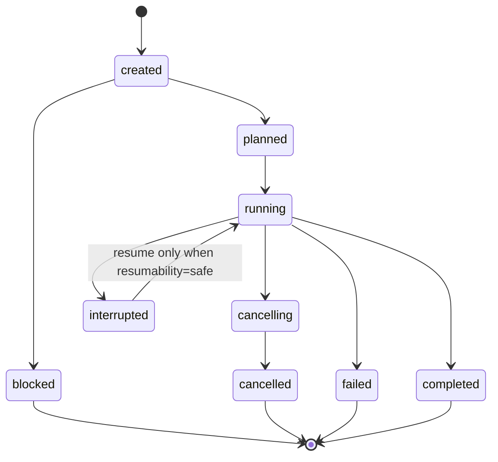

# MLX Workflow Local Protocol v1

Status: frozen for the first beta implementation. Incompatible changes require a new
`schema_version` and fixtures.

The Python CLI is the authority for workflow execution and persisted evidence. The
Swift application is a local client. It may reduce events into presentation state,
but it must never infer completion, qualification, resumability, or promotion.

## Transport and invocation

The executable entrypoint is `scripts/mlx_workflow_cli.py`. Swift launches an
allowlisted Python executable with an argument array, an explicit working directory,
and a minimal environment. Shell parsing and payload-supplied executables are
forbidden.

Machine mode writes one UTF-8 JSON object per line to stdout. Workflow commands emit
event envelopes; `cancel-status` emits the command-local control response documented
below and never appends an event from outside the journal-owning executor. Human
diagnostics and subprocess stderr remain on stderr and in stage log files. A writer
flushes each event before beginning the next unit of work.

The v1 command surface is:

| Command | Purpose | Mutates model weights |
| --- | --- | --- |
| `host` | Record the host and active-workload snapshot | No |
| `inspect` | Inspect a local model and emit capabilities | No |
| `plan` | Resolve a recipe into structured, allowlisted steps | No |
| `run` | Create an immutable run directory and execute its plan | New outputs only |
| `resume` | Continue a journal-declared resumable run | New/partial run outputs only |
| `cancel-status` | Report or request cooperative cancellation | No direct weight mutation |
| `qualify` | Evaluate declared gates against an exact parent | Evidence/staging only |

Exit codes are stable: `0` success, `2` invalid invocation/input, `3` capability or
plan blocker, `4` protocol mismatch/corrupt state, `5` execution failure, and `6`
cancelled/interrupted. A nonzero exit never substitutes for a terminal event when a
run journal exists.

## Canonical recipe and resource contract

Real model plans use one canonical recipe object. Easy and Expert controls serialize
to this same object; presentation-only labels are not recipe fields. Protocol-v1
fixture recipes remain the test-only object `{"fixture_scenario":"<name>"}` and must
never be accepted as a real model recipe.

```json
{
  "schema_version": 1,
  "exact_parent": "/absolute/inspected/model",
  "operations": ["quantize"],
  "quant_modes": ["mxfp4"],
  "allocation": {
    "strategy": "uniform",
    "target_bpw": 4.0,
    "kl_tolerance": null,
    "per_module_overrides": false
  },
  "priorities": {"quality": 0.78, "size": 0.58},
  "time_budget_seconds": 3600,
  "context_target_tokens": 32768,
  "calibration": {
    "identity": "not-applicable",
    "dataset_sha256": null,
    "sample_budget": 0,
    "token_budget": 0,
    "seed": null
  },
  "protection_rules": {
    "preserve_embeddings": false,
    "preserve_output_head": false,
    "protect_sensitive_modules": false
  },
  "validation": {
    "required_gates": [
      "provenance-structure",
      "deterministic-language-schema",
      "parent-parity"
    ],
    "critical_regressions_allowed": 0
  }
}
```

Recipe objects are closed: unknown fields, invalid ranges, duplicate values, or a
parent that differs from the inspected `--model` are invalid input. A recipe with a
future `schema_version` is a protocol mismatch. Material controls must be preserved
exactly in `recipe.json`; if the reviewed executor cannot honor one, planning returns
the stable `recipe-control-unsupported` blocker and emits no executable steps.

The first executable real recipe is uniform quantization through the reviewed
MLX-LM module argument-array route. It invokes the workspace Python directly rather
than a relocatable console-script shebang. The exact MXFP4 shape is:

```text
<workspace-python> -m mlx_lm convert
  --hf-path <exact-parent>
  --mlx-path <run-directory>/artifacts/model-mxfp4
  --quantize --q-mode mxfp4 --q-group-size 32 --q-bits 4
```

MXFP8 changes the mode/bits to `mxfp8`/`8`; affine uses `affine`, group size `64`,
and `4` bits. In v1, mixed allocation, per-module overrides,
calibration work, and explicit higher-precision protection rules remain unsupported
controls. They must block rather than silently collapse to uniform quantization.

Every real plan is a closed object with exactly these top-level keys:
`schema_version`, `run_id`, `created_at`, `workspace`, `run_directory`,
`exact_parent`, `capabilities`, `recipe`, `resource_estimate`, `blockers`, and
`steps`. A blocker contains exactly `code` and `message`. A step contains exactly
`id`, `kind`, `display_name`, `executable`, `arguments`, `working_directory`,
`environment_keys`, and `resumability`; executable steps remain subject to the
allowlist and containment rules below.

`resource_estimate` is the following closed object. Byte and second values are
non-negative integers. `estimated_duration_seconds` is nullable. The two unified
memory fields are nullable only when the host observation is unavailable. Source,
output, temporary, required-disk, and peak-memory fields are nullable together only
for the blocking `resource-model-size-unknown` case. It remains distinct from
measured run evidence.

```json
{
  "kind": "estimate",
  "basis": {
    "source": "inspected-safetensors-shard-bytes",
    "output": "quant-mode-factor-plus-64-mib-per-mode",
    "temporary": "source-bytes-plus-1-gib",
    "memory": "source-bytes-plus-2-gib",
    "host": "planning-time-read-only-snapshot"
  },
  "uncertainty": "conservative-upper-bound",
  "source_bytes": 1024,
  "estimated_output_bytes": 67109325,
  "estimated_temporary_bytes": 1073742848,
  "disk_reserve_bytes": 32212254720,
  "required_free_disk_bytes": 33353106893,
  "observed_free_disk_bytes": 57982058496,
  "estimated_peak_memory_bytes": 2147484672,
  "memory_reserve_bytes": 8589934592,
  "observed_unified_memory_bytes": 68719476736,
  "usable_unified_memory_bytes": 60129542144,
  "estimated_duration_seconds": null,
  "time_budget_seconds": 3600,
  "feasibility": "review-required",
  "reason_codes": ["duration-estimate-unknown"]
}
```

The conservative v1 basis is deterministic: output uses
`ceil(source_bytes * 0.45) + 64 MiB` for each MXFP4 or affine output and
`ceil(source_bytes * 0.75) + 64 MiB` for each MXFP8 output; temporary space is source
size plus 1 GiB; peak memory is source size plus 2 GiB; free-disk feasibility reserves
30 GiB; usable unified memory reserves 8 GiB. These are planning bounds, not
measurements of a conversion. Host facts are observed, but every derived value
remains `kind: "estimate"`.

`feasibility` is exactly `feasible`, `review-required`, or `blocked`. Reason codes are
unique sorted strings. Protocol v1 defines `duration-estimate-unknown` and
`active-workloads-present` as review reasons, `memory-observation-unknown` as the
nullable-memory review reason, and the three `resource-*` codes below as resource
blocking reasons. Recipe, source-state, and destination blockers remain only in the
plan's `blockers` array and do not appear in resource reason codes. When unified
memory cannot be observed, both unified-memory fields are `null` and the plan is
`review-required`.

Planning fails closed with no executable steps for at least:

- `resource-model-size-unknown` when source size cannot be established;
- `resource-disk-insufficient` when output, temporary space, and the 30 GiB reserve
  exceed observed free disk;
- `resource-memory-insufficient` when the conservative peak estimate exceeds the
  declared usable unified-memory budget;
- `source-state-unsupported` when the source is not a reviewed float input;
- `run-directory-exists` when the immutable destination already exists.

Unknown duration or active relevant workloads set `review-required` and name the
reason; they are never presented as measured. A CLI operator's subsequent explicit
`run --plan` invocation is the review boundary for protocol v1. Native execution must
add its own dedicated confirmation before calling `run`.

## Event envelope

Every event contains exactly these required envelope fields; additional top-level
fields are ignored in v1 and must not change reducer behavior.

```json
{
  "schema_version": 1,
  "run_id": "run-20260709-0001",
  "sequence": 42,
  "timestamp": "2026-07-09T22:00:00.000Z",
  "type": "stage.progress",
  "stage": "quantize",
  "payload": {}
}
```

- `schema_version` is the integer `1`.
- `run_id` is stable for the life of a run and matches the run directory name.
- `sequence` begins at `1` and is contiguous and strictly increasing per run.
- `timestamp` is an RFC 3339 UTC timestamp ending in `Z`.
- `type` is a dotted event name.
- `stage` is a stable stage identifier or `null` for run-level events.
- `payload` is always a JSON object. Payload additions are forward-compatible.

A client that sees `schema_version > 1` enters `protocolMismatch` and disables all
mutating actions. An unknown `type` under schema v1 is preserved in raw evidence,
advances the sequence, and is ignored by reducers. Missing required fields, a
non-integer schema or sequence, non-UTC timestamp, invalid type/stage value,
non-object payload, duplicate/out-of-order sequence, or a run-id change is journal
corruption.

### Cancellation control response

`cancel-status` is an out-of-band control query, not a journal writer. In machine
mode it returns one command-local object without event `sequence`, `timestamp`,
`type`, `stage`, or `payload` fields:

```json
{"schema_version":1,"kind":"cancel-status","run_id":"run-20260709-0001","state":"cancelling","requested_at":"2026-07-09T22:00:00.000Z","requested_by_pid":123,"grace_seconds":2.0}
```

The owning `run` process observes the atomic marker and is solely responsible for
emitting the next contiguous journal event and terminal cancellation evidence.

## Event families

| Family | v1 event types |
| --- | --- |
| Run lifecycle | `run.created`, `run.state`, `run.interrupted`, `run.completed`, `run.cancelled` |
| Inspection/plan | `capability.reported`, `plan.ready`, `plan.blocked` |
| Stage lifecycle | `stage.started`, `stage.progress`, `stage.log`, `stage.completed`, `stage.failed` |
| Evidence | `artifact.discovered`, `metric.recorded`, `evaluation.recorded` |
| Promotion | `promotion.gate` |
| Operational signals | `warning.raised`, `resource.pressure` |

`stage.progress.payload` contains `completed`, `total`, and `unit` when progress is
measurable. If a tool cannot report a truthful denominator it emits a stage log or
heartbeat-like progress with `total: null`; the UI must not synthesize a percentage.

`stage.log.payload` contains `stream` (`stdout` or `stderr`), `message`, and optional
`redacted: true`. Logs are evidence, not commands.

`promotion.gate.payload.status` is `pending`, `passed`, `failed`, or
`not-applicable`. Green qualification is permitted only when every required gate is
`passed` and no blocker is active.

## Run state and recovery

The manifest state is one of `created`, `planned`, `blocked`, `running`,
`cancelling`, `cancelled`, `interrupted`, `failed`, or `completed`. Resumability is a
separate value: `not-applicable`, `safe`, `unsafe`, or `unknown`.



`completed` means workflow execution reached its declared terminal point; it does
not imply qualification or promotion. Blocked, failed, interrupted, and cancelled
runs can never appear promoted.

On relaunch, the client reads `run.json`, replays `events.jsonl`, and treats the
journal as authoritative. A final unterminated or malformed JSON fragment is
tolerated only at end of file and is reported as a recoverable corrupt tail. Any
earlier malformed line is corruption. If the manifest is stale, a replay-derived
state may be shown while the CLI repairs the manifest atomically.

## Run directory v1

```text
<workspace>/<run-id>/
  run.json
  events.jsonl
  capabilities.json
  host.json
  recipe.json
  plan.json
  commands.json
  versions.json
  inputs/
  logs/<stage>.stdout.log
  logs/<stage>.stderr.log
  artifacts/
  evaluations/
  gates.json
  rollback.json
```

`run.json` includes `schema_version`, `run_id`, state, resumability, exact parent,
timestamps, last committed sequence, blockers, and terminal reason. It is written to
a sibling temporary file, flushed, and atomically renamed. `events.jsonl` is
append-only.

`commands.json` stores executable identity, argument arrays, working directory,
allowlisted environment keys, and a redacted display form. Secrets and credentials
must never be persisted. Paths are accepted only as data arguments and never
reparsed as shell text.

## Cancellation

Cancellation is cooperative first: write the run cancellation marker and signal only
processes launched for that run. After the documented grace interval, the runner may
terminate and then force-kill only those recorded child process identifiers. The
journal records signal/time, affected PIDs, last completed stage, partial artifacts,
and resumability. Partial candidates are never qualified.

## Immutability and promotion

The parent model is read-only. Every workflow output and promotion stage is a new
directory. Promotion requires a manifest, hashes, exact commands, versions, raw gate
evidence, and rollback metadata. The protocol cannot publish, overwrite an LM Studio
artifact, or delete a model; those remain separate confirmed actions outside beta v1.
